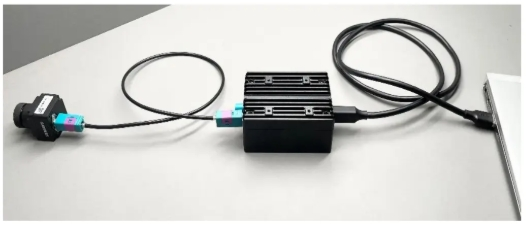
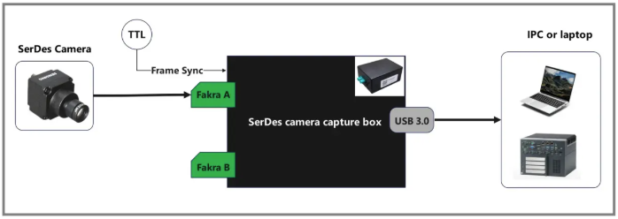
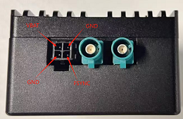
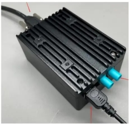
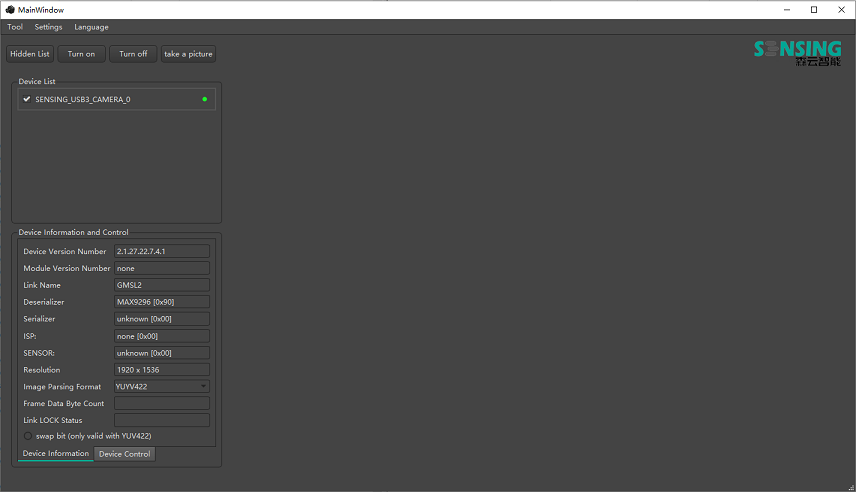

# SensingCaptureV2 User Manual

## **Overview**

**SensingCaptureV2** is a software tool designed to work with SENSING SG8-U30-xxxx device performing functions such as camera image effect preview, camera firmware upgrade, and camera parameter debugging.  
This tool supports the following SG8-U30-xxxx devices:

* SG8-U30-GMSL2
* SG8-U30-GMSL2-T4
* SG8-U30-FPDLink
* SG8-U30-FPDLink-T4
* SG8-U30-Vbyone  

**NOTE:** The software tool only supports the Windows operating system.

## **Hardware Connection**

1. Connect the camera module to **SG8-U30-xxxx** device through Fakra coaxial cable.

   * In the usage scenario where only one camera is connected, it is usually connected to the outermost Fakra interface, as shown in the following figure.  
     
2. Plug the **USB cable** into your computer's **USB 3.0** data port. The application method is shown in the following figure.

   
3. For devices of non-T4 models (such as SG8-U30-GMSL2), external input of FSYNC camera trigger synchronization signals is supported, and external power supply is also supported. The connector definitions are shown in the following figure:
   

   VBAT:  
   external power supply. A power supply range of 9 to 16 volts is supported. After using external power supply, all the power supplies on the SG8-U30-xxxx device will be obtained from the external power supply, and the power from the USB interface will no longer be used.

   FSYNC:  
   external input of FSYNC camera trigger synchronization signals.

   **NOTE:** In the design of the hardware circuit, the FSYNC signal is inverted. For example, when the external input is at a high level, the actual internal signal provided to the camera is at a low level. This point needs to be noted when using it.

4. For devices of T4 models (such as SG8-U30-GMSL2-T4), camera firmware burning is supported, but FSYNC signal input and external power supply are not supported.
   When you want to upgrade the camera's firmware, you need connect the interface shown in the following figure to the PC using a **micro usb cable**.

   

## **Installation Instructions**

1. Clone or download the **SensingCaptureV2** repository to your PC.
2. run and install **vcredist** under the **packages** directory.
3. Then you can execute **SensingCaptureV2.exe** to start this software tool.
4. After a successful startup, the interface is as shown below. 
    * You can select the interface language through **Language** in the menu bar. Both Chinese and English are supported.
    * The identified SG8-U30-xxxx devices will be displayed in the **Device List** area.
    * Some parameter information of the devices and cameras is displayed in the **Device Information** area.
    * Some controls can be performed on the camera in the **Device Control** table, such as parameter configuration and register adjustment.

    

## **Basic Software Functions**

#### **Firmware Upgrade**

To upgrade the firmware of your camera:

1. Go to **Tools** > **Camera Firmware Upgrade** in the top menu.
2. In the **Choose ISP Version** dropdown, select the correct camera ISP type.
3. Click **Confirm** to close the window, and then reopen it to access the firmware upgrade interface.
4. In the firmware upgrade window, select the firmware file you wish to upgrade, and enter the camera's **serial number** (this is found on the camera's label).
5. Click **Start Update** to begin the firmware upgrade process.

   For additional details on the firmware upgrade, refer to the **GW5** and **Sony Firmware Upgrade** documents in the **Document** folder.

#### **Device I2C Switching**

To switch between I2C address modes:

1. Navigate to **Tools** > **Device I2C Switching** in the top menu.
2. You will need to connect the **micro usb cable** to PC and switch to **MCU mode**
   - Before upgrading firmware, make sure the camera is in **MCU mode**.
   - For normal operation (reading/writing registers), keep it in **USB mode**.

#### **Register Read/Write**

To read or write to the camera registers:

1. Get into the **Device Control** table
2. In the **I2C Address** input field, enter the desired I2C address (8-bit format). Note that a 7-bit address must be shifted left by 1 bit.
3. In **Register Address Width**, select the width for the register address (either 8-bit or 16-bit).
4. Enter the register address you want to read or write in the **Register Address** field.
5. In the **Read - Write Sequence** dropdown, select the desired sequence (MSB-first or LSB-first).
6. Choose the **Register Value Width** (8-bit or 16-bit).
7. In the Register Value field, enter the value to be read or written.
   - If you are **reading**, click the **Read** button. If successful, the value will be displayed.
   - If you are **writing**, click the **Write** button to send the value to the register.

#### **Load Configuration Parameters**

 To configure the camera for normal operation:

1. Load the configuration to initialize the sensor, serializer, and deserializer.
2. The software will retrieve image formats and resolution settings, which need to be correctly configured for proper image capture.

To load a configuration:

1. Click the **Load Configuration** button to open the configuration window.
2. From the **Configuration File** dropdown, select the desired configuration. You can also use the fuzzy search feature to quickly locate the configuration you need.
3. If the built-in configuration file does not open correctly, use the **Manual Loading** button to load the configuration manually.

Once the configuration is loaded:

1. Use the **Turn On** button to start the video stream.
2. Use the **Turn Off** button to stop the video stream.

You can also view the current settings by selecting **Device Information** from the menu.
